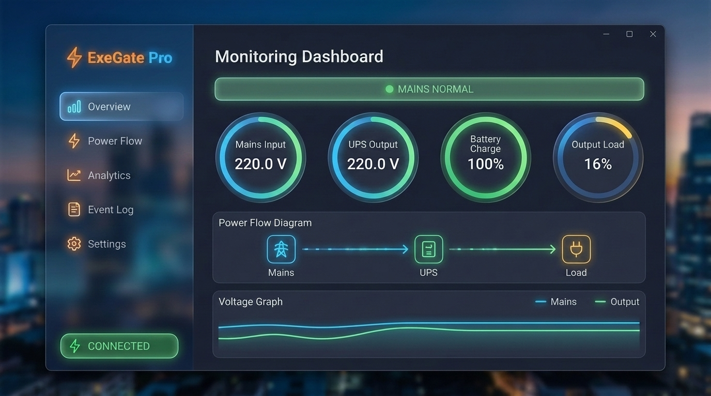
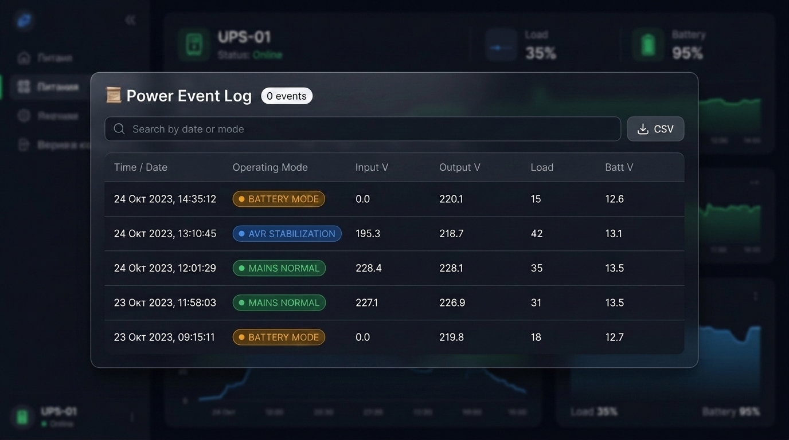

# ExeGate SpecialPro — UPS Monitor (UNB & Smart LLB Series)

<p align="center">
  <b>Language / Язык:</b> 
  <b>English</b> | <a href="README_RU.md">Русский</a>
</p>

[](https://python.org)
[](https://fastapi.tiangolo.com)
[](#)
[](#)
[](LICENSE)

A modern web and desktop monitoring application for **ExeGate SpecialPro** series (**UNB-1200**, **Smart LLB-2200**, **UNB-600/800/1500**, **LLB-3000**, and compatible RichComm / Megatec F protocol devices over USB HID) featuring **graceful Windows auto-shutdown**, **system tray icon**, **dual-language UI (English & Russian)**, **power grid analytics**, and **real-time telemetry**.

<p align="center">
  <a href="assets/ups_monitor_showcase.mp4">
    
  </a>
  <br>
  <sub>🎬 <b>Watch Full Video Showcase (1080p, EN Voiceover + RU Subtitles)</b>: Click the preview or open <a href="assets/ups_monitor_showcase.mp4"><code>assets/ups_monitor_showcase.mp4</code></a></sub>
</p>


<details>
  <summary>📸 <b>Static UI Screenshots (Click to expand)</b></summary>
  <br>
  <p align="center">
    
  </p>
  <p align="center">
    
  </p>
</details>

---

## ✨ Features

- 📊 **Power Grid Historical Analytics & Incident Diagrams**: Interactive analytics dashboard with time-range selector (**24 Hours**, **7 Days**, **30 Days**, **All Time**), 4 KPI summary cards (Battery Runtime & Outages, Grid Stability Index, AVR Activations, Voltage Extremes), Daily Incidents Bar Chart, Modes Distribution Doughnut Chart, and 24-Hour Peak Disturbance Histogram.
- 💡 **Energy Consumption & Electricity Cost Calculator**: Real-time total grid power calculation (P_total = P_connected_load + P_ups_internal), cost rate estimator per hour, per 24h, and projected monthly cost with customizable electricity tariff (руб/kWh).
- 🔋 **Session kWh & Cost Tracker**: Millisecond-accurate accumulated energy consumption tracker (kWh) and total cost with 1-click counter reset.
- 🛡️ **USB Telemetry Resilience & Grace Period**: 4-second telemetry hold buffer (`FROZEN` badge) preventing metrics dropouts during temporary USB HID Cypress UART polling delays.
- 🌐 **Dual-Language Support (EN / RU)**: Full internationalization with real-time language switching button and persistent language settings.
- ⚡ **Real-Time Telemetry**: Live monitoring of Input/Output voltage, grid frequency, internal temperature, load percentage (%), and power consumption (Watts).
- 🛑 **Graceful Windows Auto-Shutdown**: Automatic safe PC shutdown (`shutdown.exe`) when battery drops below threshold, with countdown timer and 1-click cancel button.
- 🖥️ **Windows System Tray**: Tray icon with live color status glow, tooltips, and context control menu.
- 💬 **Windows Native Toast Notifications**: Pop-up OS notifications for power mode transitions (Mains / AVR / Battery).
- 🔌 **Interactive 4× 220V Outlets Map**: Visual map for 4× Schuko CEE 7/4 sockets with customizable device labels (PC, Monitor, Router) and memory.
- 🎯 **Segmented Radial Gauges**: 20-segment arc scales with neon gradient styling.
- 🔋 **Smart Battery Percentage Calculation**: Intelligent battery level estimation based on voltage discharge curves and operating mode.
- 🔄 **Interactive Power Flow Diagram**: Dynamic energy flow scheme (Mains $\rightarrow$ UPS $\rightarrow$ Load / Battery) with animated current pulse indicators.
- 📈 **Live Voltage Dynamics & Historical Charting**: Built-in real-time and historical graphs powered by `Chart.js`.
- 🔔 **Audio & Push Alerts**: Dual-layer sound chime alerts and browser push support.
- 🔌 **Multi-Model UPS Support (UNB-1200, Smart LLB-2200, etc.)**: Built-in presets with automatic rated wattage scaling (360W, 480W, 750W, 900W, 1200W, 1800W, or Custom) and intelligent auto-detection of multi-battery voltage banks (12V / 24V / 48V).
- ℹ️ **Dedicated "About" View**: Information dashboard displaying version badges, developer info (`@ALEVOLDON`), MIT license, and direct GitHub links.
- 📜 **Event Logging & CSV Export**: Automatic recording of power events with 1-click CSV file export and dynamic historical log translation.
- 💻 **Desktop & Web Modes**: Launch as a native Windows desktop app (`pywebview` + `pystray`) or a standalone Web Server.
- 🚀 **1-Click Windows Setup (`install.bat`)**: Automatic Python check, dependency installation, and desktop shortcut creation in a single click.

---

## 🛠️ Project Structure

```text
UPS ExeGate SpecialPro UNB-1200/
├── app/
│   ├── config.py           # Centralized configuration & constants
│   ├── netutil.py          # Network utilities & port checker
│   ├── notifications.py    # Native Windows Toast notifications
│   ├── protocol.py         # Megatec F protocol parser & data cleaner
│   ├── server.py           # FastAPI web server, REST API & WebSockets
│   ├── shutdown_manager.py # Windows graceful shutdown manager
│   ├── sound_manager.py    # Async native Windows sound alert player
│   ├── tray_icon.py        # Windows system tray icon (pystray)
│   ├── ups_driver.py       # USB HID background polling thread & state tracking
│   └── static/             # Web UI assets (translations.js, app.js, styles.css)
├── tools/                  # USB HID diagnostic scripts & protocol tests
├── desktop_app.py          # Native desktop application (pywebview + tray)
├── main.py                 # Standalone web server launcher (uvicorn)
├── install.bat             # 1-Click installer (dependencies + desktop shortcut)
├── Run_UPS_Monitor.bat     # Quick launcher batch script
├── Run_UPS_Monitor.vbs     # Silent background launcher (no console window)
├── create_shortcut.ps1     # PowerShell script to generate Desktop shortcut
└── requirements.txt        # Python dependencies (pystray, Pillow, pywebview, etc.)
```

---

## 🚀 Quick Start & Installation

### 0. Prerequisites
Ensure **Python 3.10+** is installed on your computer (download from [python.org](https://www.python.org/downloads/)).  
⚠️ **IMPORTANT:** Be sure to check the box **"Add python.exe to PATH"** during installation!

---

### Option 1: 1-Click Installer (Recommended)
Simply double-click **`install.bat`**.  
The script automatically verifies your Python installation, installs all dependencies from `requirements.txt`, creates the **"ExeGate UPS Monitor"** shortcut on your Desktop, and asks if you'd like to launch right away!

---

### Option 2: Manual Installation

#### 1. Install Dependencies
```bash
pip install -r requirements.txt
```

#### 2. Run the Application
- **Desktop Window (Recommended)**: double-click `Run_UPS_Monitor.vbs` (runs silently without a console window) or:
  ```bash
  python desktop_app.py
  ```
- **Standalone Web Server**:
  ```bash
  python main.py
  ```
  Open your browser at `http://127.0.0.1:8000`.

- **Manual Desktop Shortcut Creation**:
  ```powershell
  powershell -ExecutionPolicy Bypass -File .\create_shortcut.ps1
  ```

---

## ⚙️ Configuring Your UPS Model (UNB-1200 / Smart LLB-2200 / etc.)

The default configuration is tailored for **ExeGate SpecialPro UNB-1200 (750 W)**.  
If you are using a different model from the lineup:
1. Launch the application and click the **"Settings"** tab in the sidebar.
2. Under **"UPS Model & Rated Power"**, choose your model (e.g. `Smart LLB-2200 (1200W)` or Custom).
3. Under **"Battery Configuration"**, keep `Auto-detect (12V / 24V / 48V)` (or specify manually).
4. Click **"Save Settings"**. Gauges, percentages, and labels will immediately adjust!

---

## 🔌 Technical Protocol Details

- **Vendor ID**: `0x0665`
- **Product ID**: `0x5161`
- **Protocol**: RichComm / Megatec (Command `F\r`)
- **Response Format**: `F(MMM.M NNN.N PPP.P QQQ RR.R S.SS TT.T b7b6b5b4b3b2b1b0`

---

## 📄 License

This project is licensed under the [MIT License](LICENSE).
