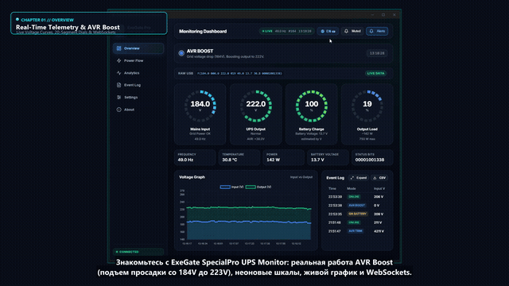
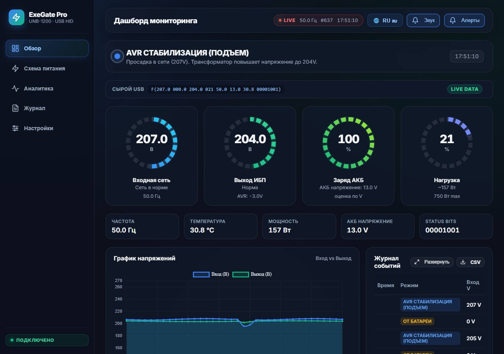
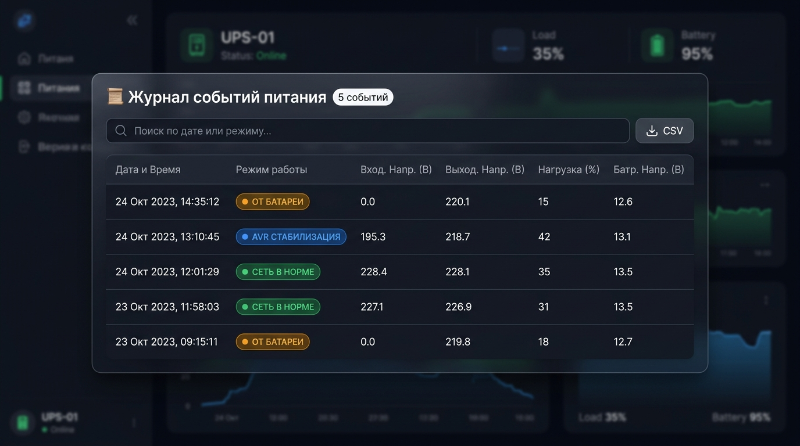

# ExeGate SpecialPro — Мониторинг ИБП (серии UNB и Smart LLB)

<p align="center">
  <b>Язык / Language:</b> 
  <b>Русский</b> | <a href="README.md">English</a>
</p>

[](https://python.org)
[](https://fastapi.tiangolo.com)
[](#)
[](#)
[](LICENSE)

Современное веб- и десктоп-приложение для мониторинга состояния ИБП линейки **ExeGate SpecialPro** (**UNB-1200**, **Smart LLB-2200**, **UNB-600/800/1500**, **LLB-3000** и совместимых устройств на протоколе RichComm / Megatec F через USB HID) с поддержкой **двух языков (английский и русский)**, **безопасного автовыключения Windows**, **аналитики электросети** и **системного трея**.

<p align="center">
  <a href="assets/ups_monitor_showcase.mp4">
    
  </a>
  <br>
  <sub>🎬 <b>Смотреть видеопрезентацию (1080p, английская озвучка + русские субтитры)</b>: нажмите на превью или откройте <a href="assets/ups_monitor_showcase.mp4"><code>assets/ups_monitor_showcase.mp4</code></a></sub>
</p>

<p align="center">
  
</p>

<p align="center">
  
</p>

---

## ✨ Основные возможности

- 📊 **Историческая статистика сети и диаграммы инцидентов**: Интерактивный дашборд аналитики с фильтрацией периодов (**24 часа**, **7 дней**, **30 дней**, **За всё время**), 4 KPI-карточками (Время от АКБ и число отключений, Индекс стабильности сети, Срабатываний AVR, Диапазон напряжений), столбчатой диаграммой сбоев по дням, круговой диаграммой режимов и 24-часовой гистограммой пиковых часов просадок.
- 💡 **Энергопотребление и калькулятор расходов**: Расчет суммарной мощности из розетки (P_сеть = P_приборы + P_ИБП), стоимости электроэнергии в час, в сутки и прогноза на месяц по настраиваемому тарифу (руб/кВт⋅ч).
- 🔋 **Счетчик кВт⋅ч и затрат за сессию**: Накопительный учет израсходованного электричества и денег с возможностью сброса счетчика в 1 клик.
- 🛡️ **Защита телеметрии от задержек USB (Grace Period)**: 4-секундный буфер удержания данных (бейдж `FROZEN`), исключающий сброс показаний в ноль при микрозадержках опроса USB HID.
- 🌐 **Двуязычный интерфейс (EN / RU)**: Полноценная локализация с мгновенным переключением языка по кнопке в шапке и сохранением настроек.
- ⚡ **Мониторинг в реальном времени**: Отображение входного/выходного напряжения, частоты сети, температуры, нагрузки (%) и мощности (Вт).
- 🛑 **Автовыключение Windows (Graceful Shutdown)**: Автоматическое безопасное завершение работы ПК (`shutdown.exe`) при разряде АКБ ниже настроенного порога с таймером отсчета и отменой в 1 клик.
- 🖥️ **Системный трей Windows**: Иконка в трее с живым статусом питания, всплывающими подсказками и быстрым меню управления.
- 💬 **Нативные уведомления Windows Toast**: Всплывающие системные карточки Windows при сменах режимов (Сеть / AVR / Батарея).
- 🔌 **Интерактивная карта 4 розеток 220V**: Визуализация подключений Schuko 220V с персональными названиями приборов (ПК, Монитор, Роутер) и памятью.
- 🎯 **Дольчатые круговые индикаторы**: Сегментированные радиальные шкалы (20 долек) с градиентной неоновой подсветкой.
- 🔋 **Оценка заряда АКБ**: Интеллектуальный расчёт уровня заряда аккумулятора по кривым напряжения с учётом текущего режима работы.
- 🔄 **Интерактивная схема питания**: Визуализация потоков энергии (Сеть $\rightarrow$ ИБП $\rightarrow$ Нагрузка / Батарея) с анимацией импульсов тока.
- 📈 **Динамика напряжений и исторические графики**: Встроенные живые и аналитические графики на основе `Chart.js`.
- 🔔 **Звуковые и Push-уведомления**: Двухуровневые звуковые оповещения и поддержка браузерных уведомлений.
- 🔌 **Поддержка различных моделей ИБП (UNB-1200, Smart LLB-2200 и др.)**: Выбор пресетов моделей с автоматической подстройкой номинальной мощности (360 Вт, 480 Вт, 750 Вт, 900 Вт, 1200 Вт, 1800 Вт или Custom) и умным автоопределением вольтажа АКБ (12V / 24V / 48V).
- ℹ️ **Вкладка «О программе» (About)**: Информационный экран с версией приложения, информацией об авторе (`@ALEVOLDON`), лицензией MIT и быстрыми ссылками на репозиторий, релизы и тикеты GitHub.
- 📜 **Журнал событий и экспорт CSV**: Автоматическая фиксация событий переключения режимов с возможностью экспорта в CSV в 1 клик и динамическим переводом старых логов.
- 💻 **Десктопный и веб-режим**: Запуск в окне Windows (через `pywebview` + `pystray`) или веб-сервера.
- 🚀 **Установка в 1 клик (`install.bat`)**: Автоматическая проверка Python, установка всех библиотек и создание ярлыка на Рабочем столе в один клик.

---

## 🛠️ Архитектура проекта

```text
UPS ExeGate SpecialPro UNB-1200/
├── app/
│   ├── config.py           # Централизованные константы и параметры
│   ├── netutil.py          # Сетевые утилиты и проверка портов
│   ├── notifications.py    # Нативные системные уведомления Windows Toast
│   ├── protocol.py         # Парсер протокола Megatec F и очистка сырых кадров
│   ├── server.py           # FastAPI веб-сервер, REST API и WebSockets
│   ├── shutdown_manager.py # Менеджер безопасного завершения работы Windows
│   ├── sound_manager.py    # Асинхронный звуковой движок для Windows
│   ├── tray_icon.py        # Иконка в системном трее Windows (pystray)
│   ├── ups_driver.py       # Фоновый опрос USB HID устройства и трекинг
│   └── static/             # Веб-интерфейс (translations.js, app.js, styles.css)
├── tools/                  # Диагностика и утилиты тестирования USB
├── desktop_app.py          # Десктопная версия (pywebview + tray)
├── main.py                 # Консольный веб-сервер (uvicorn)
├── install.bat             # Установка в 1 клик (зависимости + ярлык)
├── Run_UPS_Monitor.bat     # Быстрый запуск
├── Run_UPS_Monitor.vbs     # Тихий запуск (без окна консоли)
├── create_shortcut.ps1     # Скрипт создания ярлыка на Рабочем столе
└── requirements.txt        # Зависимости Python (pystray, Pillow, pywebview и др.)
```

---

## 🚀 Быстрый запуск и установка

### 0. Предварительные требования
Убедитесь, что на компьютере установлен **Python 3.10+** (скачать с [python.org](https://www.python.org/downloads/)).  
⚠️ **ВАЖНО:** Во время установки Python обязательно отметьте галочку **«Add python.exe to PATH»**!

---

### Вариант 1. Установка в 1 клик (рекомендуется)
Просто дважды кликните по файлу **`install.bat`**.  
Скрипт автоматически проверит Python, установит библиотеки из `requirements.txt`, создаст ярлык **«ExeGate UPS Monitor»** на вашем Рабочем столе и предложит сразу запустить программу!

---

### Вариант 2. Ручная установка

#### 1. Установка зависимостей
```bash
pip install -r requirements.txt
```

#### 2. Запуск приложения
- **Десктопное окно (рекомендуется)**: запустите `Run_UPS_Monitor.vbs` (без консоли) или:
  ```bash
  python desktop_app.py
  ```
- **Веб-сервер в браузере**:
  ```bash
  python main.py
  ```
  Интерфейс откроется по адресу `http://127.0.0.1:8000`.

- **Ручное создание ярлыка на Рабочем столе**:
  ```powershell
  powershell -ExecutionPolicy Bypass -File .\create_shortcut.ps1
  ```

---

## ⚙️ Настройка модели ИБП (UNB-1200 / Smart LLB-2200 / и др.)

По умолчанию программа настроена на модель **ExeGate SpecialPro UNB-1200 (750 Вт)**.  
Если у вас другая модель линейки:
1. Запустите программу и откройте вкладку **«Настройки»** в левом меню.
2. В блоке **«Модель ИБП и номинальная мощность»** выберите ваше устройство (например, `Smart LLB-2200 (1200W)` или другую модель/Custom).
3. В блоке **«Конфигурация батареи»** оставьте `Автоопределение (12V / 24V / 48V)` (или выберите режим вручную).
4. Нажмите **«Сохранить настройки»**. Нагрузочные шкалы, проценты аккумулятора и плашки интерфейса мгновенно перестроятся под ваш ИБП!

---

## 🔌 Технические подробности

- **Vendor ID**: `0x0665`
- **Product ID**: `0x5161`
- **Протокол**: RichComm / Megatec (команда `F\r`)
- **Формат ответа**: `F(MMM.M NNN.N PPP.P QQQ RR.R S.SS TT.T b7b6b5b4b3b2b1b0`

---

## 📄 Лицензия

Проект распространяется под лицензией [MIT](LICENSE).
